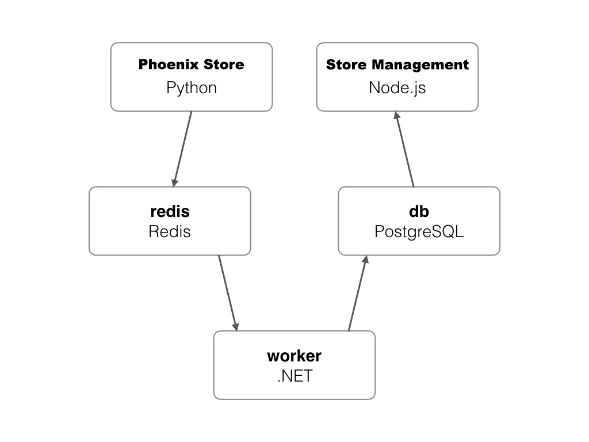
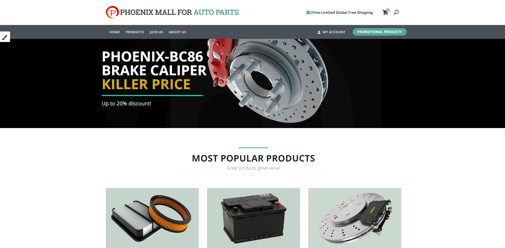
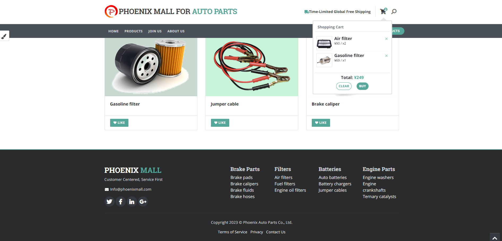
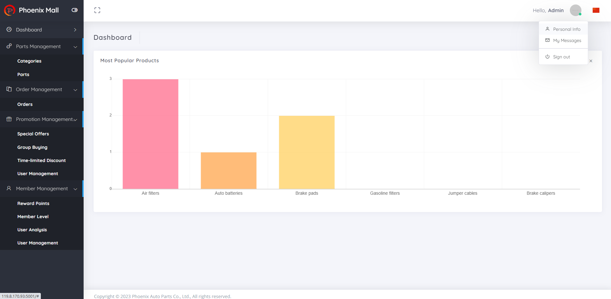

Sample Code of Phoenix Mall
=========

### Overview

> [Phoenix Mall] is an e-mall. Its sample code features complex structure, simple logic, small amount of code, and rich technology stacks. It helps developers quickly learn various features of CodeArts and problems that may occur during software development, testing, and deployment using microservices.

#### Architecture and Business Scenarios

The Phoenix Mall application consists of the following microservices that can be separately developed, tested, and deployed:

* Client UI service
  * Logic: Users can access this web UI from a browser and click **Like** under a product. The records of the selected products will be saved in the Redis cache.
  * Technology stacks: Python and Flask
  * Application server: Gunicorn
* Management UI service
  * Logic: You can access this web UI from a browser and view users' Like data dynamically. This data comes from the PostgreSQL database.
  * Technology stack: node.js and express framework
  * Application server: server.js
* Working process service
  * This is a backend process. It monitors product records in the Redis cache, obtains new records, and saves them in the PostgreSQL database so that data can be extracted for display on the management UI.
  * Technology stacks: .net core or java (This service provides two technology stacks to implement the same function. You can modify the configuration and select one stack as a running process.) 
* Redis cache
  * Logic: Persists data for the client UI.
* PostgreSQL database
  * Logic: Persists data for the management UI.

#### Application Architecture

#### Client UI

#### Management UI

